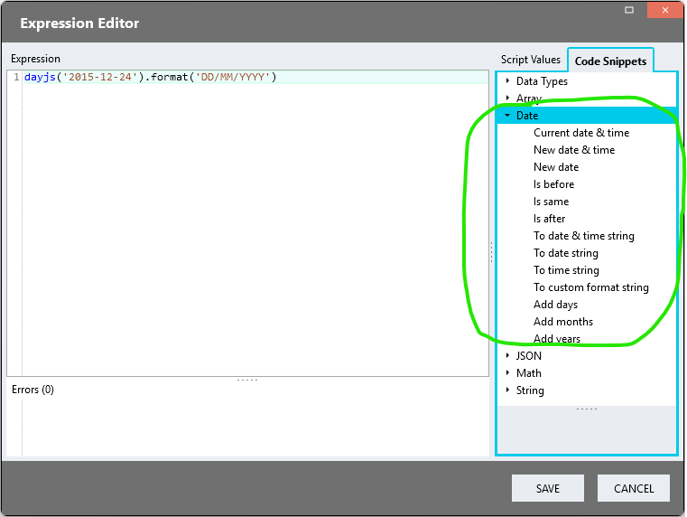
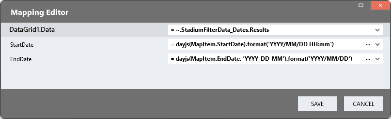

# How-To: Working With Dates <!-- omit in toc -->

In Stadium controls, we can manipulate a wide range of values in expressions. To format dates, we can use the [DayJS date library](https://day.js.org/en/). DayJS is a JavaScript library that parses, validates, manipulates, and displays dates and times for modern browsers. 

Due to the large variety of date formats in use, it is impossible to determine the compatibility of any specific format with Stadium controls that display and handle dates in this document. Date formats must therefor usually be tested in the context of specific implementations. 

## Table Of Contents <!-- omit in toc -->
- [Expression Editor](#expression-editor)
- [Converting Strings to Dates](#converting-strings-to-dates)
- [Defining Date Formats](#defining-date-formats)
- [Unupported Date Formats](#unupported-date-formats)
- [DayJS Formatting Guide](#dayjs-formatting-guide)
- [DatePicker Control](#datepicker-control)
- [DataGrid Dates](#datagrid-dates)
  - [Display](#display)
  - [Search](#search)

## Expression Editor

The code snippets section in the Stadium Expression Editor contain a variety of entries for manipulating various data types, including dates. 



## Converting Strings to Dates

To format a date, we usually need to first call the DayJS function to turn the string into a JavaScript date. DayJS can handle a wide range of input formats. 

```javascript
dayjs('2018-04-04T16:00:00.000Z')
dayjs('2018-04-13 19:18:17.040+02:00')
dayjs('2018-04-13 19:18')
```

## Defining Date Formats

Once a string has been converted to a valid Javascript date, we can define an output format for it: 

```javascript
dayjs('2019-01-25').format('DD/MM/YYYY')
dayjs('2019-25-01').format('DD-MM-YYYY')
dayjs('2019-25-01').format('YYYY-DD-MM')
```

## Unupported Date Formats

When a date is not understood by DayJS it cannot be converted. In such cases DayJS returns the string **"Invalid Date"**. This problem is solved by passing the format of the date to DayJS: 

```javascript
dayjs('2019-01-25', 'YYYY-MM-DD')
dayjs('25-01-2925', 'DD-MM-YYYY')
dayjs('2019-01-11', 'YYYY-DD-MM')
dayjs('2019-01-11', 'YYYY-MM-DD')
```

## DayJS Formatting Guide

The [DayJS date formatting guide](https://day.js.org/docs/en/display/format#list-of-all-available-formats) provides a wide range of options for reformatting dates. 

List of all available formats

|Format |	Output |	Description|
| :--- | :------- | :------------ |
|YY |	18 |	Two-digit year|
|YYYY |	2018 |	Four-digit year|
|M |	1-12 |	The month, beginning at 1|
|MM |	01-12 |	The month, 2-digits|
|MMM |	Jan-Dec |	The abbreviated month name|
|MMMM |	January-December |	The full month name|
|D |	1-31 |	The day of the month|
|DD |	-31 |	The day of the month, 2-digits|
|d |	0-6 |	The day of the week, with Sunday as 0|
|dd |	Su-Sa |	The min name of the day of the week|
|ddd |	Sun-Sat |	The short name of the day of the week|
|dddd |	Sunday-Saturday |	 name of the day of the week|
|H |	0-23 |	 hour|
|HH |	00-23 |	The hour, 2-digits|
|h |	1-12 |	The hour, 12-hour clock|
|hh |	01-12 |	The hour, 12-hour clock, 2-digits|
|m |	0-59 |	The minute|
|mm |	00-59 |	The minute, 2-digits|
|s |	0-59 |	The second|
|ss |	00-59 |	The second, 2-digits|
|SSS |	000-999 |	The millisecond, 3-digits|
|Z |	+05:00 |	The offset from UTC, ±HH:mm|
|ZZ |	+0500 |	The offset from UTC, ±HHmm|
|A |	AM |	PM	|
|a |	am |	pm	|

## DatePicker Control

The DatePicker control gets it's date format from a settings file on the Stadium Application Server (SAM). By default Stadium applications use the following format in the DatePicker: 

```javascript
'YYYY/MM/DD'
'2019/01/18'
```

Some dates are automatically converted to the DatePicker format, others need to be converted in an expression before being passed to a DatePicker control. How the DatePicker handles the date format used in a specific application needs to be evaluated in that implementation. 

```javascript
dayjs('19/01/2025', 'DD/MM/YYYY').format('YYYY/MM/DD')
dayjs('01-19-2025', 'MM-DD-YYYY').format('YYYY/MM/DD')
dayjs('14.12.2025', 'DD.MM.YYYY').format('YYYY/MM/DD')
```

## DataGrid Dates

The DataGrid control gets it's date format from a settings file on the Stadium Application Server (SAM). By default Stadium applications use the following format in the DataGrid: 

```javascript
'YYYY/MM/DD'
'2019/01/18'
```

The DataGrid natively also understands dates in [ISO 8601](https://en.wikipedia.org/wiki/ISO_8601). DateTime values passed to the DataGrid in this format are automatically converted to Dates before they are displayed. 

### Display

Dates can be converted in the Mapping Editor before they are displayed in a DataGrid. 



### Search

[Lucene](https://lucene.apache.org/core/2_9_4/queryparsersyntax.html) is a library created and maintained by the Apache Software Foundation that Stadium uses to index and search DataGrid data. When searching DataGrids, Stadium passes the search string to Lucene and displays the data it returns in the DataGrid or an error below the search box. 

Lucene has it's [own syntax](https://docs.stadium.software/controls/data-grid-search#dates) to enable date searches. It also natively understands dates in [ISO 8601](https://en.wikipedia.org/wiki/ISO_8601). How it handles other date formats is not described in the documentation and needs to be evaluated in the context of each specific implementation. 